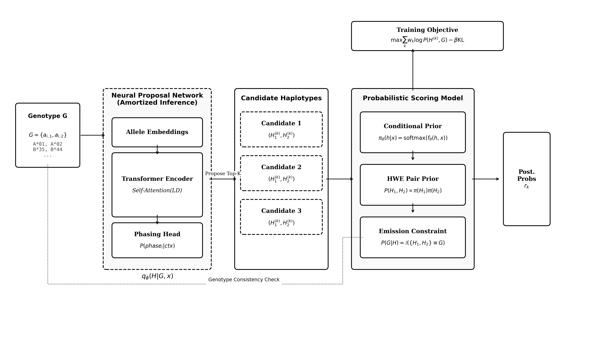
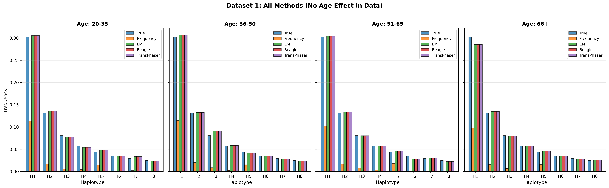

## Introduction: The Phasing Problem

- **Phasing**: Determining which alleles were inherited from a single parent.
- **Why is it hard?** 
  - Genotyping data gives us the mix of two alleles at each locus $\{a_{i,1}, a_{i,2}\}$ but not their order.
  - We don't know if $(a_{1,1}, a_{2,1})$ came from father or $(a_{1,1}, a_{2,2})$.
- **Crucial for**: 
  - Transplantation (donor matching)
  - Disease association studies
  - Population genetics

## The HLA Challenge

- **HLA (Human Leukocyte Antigen)**: Chromosome 6.
- **Characteristics**:
  - Most polymorphic region in human genome (hundreds of alleles).
  - Complex Linkage Disequilibrium (LD) patterns.
- **The Issue**:
  - Classical algorithms (HMMs, standard EM) struggle here.
  - They need large reference panels or break down under extreme diversity.

## Deep Dive: Classical EM

- **How it works**: 
  - Iteratively estimates haplotype frequencies from genotype data.
  - **E-Step**: Calculate probability of every possible phasing for every individual based on current frequencies.
  - **M-Step**: Update population frequencies based on those probabilities.
- **Strength**: 
  - Statistically rigorous.
  - Mathematically guaranteed to improve likelihood.
- **Weakness**: 
  - **Combinatorial Explosion**: With $k$ heterozygous loci, there are $2^{k-1}$ possible pairs. 
  - For HLA (many loci), checking *every* combination is impossible.

## Deep Dive: Hidden Markov Models (Beagle)

- **How it works**: 
  - Represents haplotypes as paths through a graph of states.
  - Probability of an allele depends only on the immediate previous alleles (Markov Property).
- **Strength**: 
  - **Speed**: Scales linearly $O(k)$ with number of loci.
  - State-of-the-art for large-scale genomic data.
- **Weakness**: 
  - **"Short Memory"**: Struggles to model complex dependencies between distant loci (e.g., Locus 1 strongly interacting with Locus 6).
  - High-order LD requires massive reference panels to capture.

## Synthesis: How TransPhaser Wins

- **The Problem**: 
  - EM is rigorous but too slow.
  - Beagle is fast but has "short memory".
- **The TransPhaser Solution**:
  1.  **Fixing EM's Speed**: Instead of calculating $2^{k-1}$ sums (Classic EM), we use a **Neural Network** to predict the top-64 most likely pairs instantly ("Amortized Inference").
  2.  **Fixing Beagle's Memory**: Instead of a Markov Chain, we use a **Transformer**. Self-attention allows every locus to "look at" every other locus, capturing infinite-range LD.

## Introducing TransPhaser

- **What is it?** 
  - A **Neural Expectation-Maximization** framework.
- **Key Innovation**:
  - **Amortized Inference**: Uses a Neural Network to guess the likely haplotypes instantly (Amortized E-step).
  - **Probabilistic Rigor**: Uses a rigorous statistical model to validate those guesses.
- **Result**:
  - Combines Deep Learning flexibility with Statistical constraints.

## TransPhaser vs. The World

| Feature | Classic EM | Beagle (HMM) | TransPhaser |
|---------|------------|--------------|-------------|
| **Speed** | Slow | Fast | **Fast (Inference)** |
| **Dependencies** | Short-range | Markov | **Long-range (Transformer)** |
| **Covariates** | Hard to use | Stratification | **Native Support** |
| **Accuracy** | Moderate | High | **State-of-the-art** |

## Methods Overview

- **Goal**: Infer Haplotypes $(H_1, H_2)$ from Genotype $G$.
- **Approach**: Maximum Likelihood with Latent Variables.
- **Four Core Components**:
  1.  Neural Proposal Network
  2.  Conditional Haplotype Prior
  3.  HWE Equillibrium Model
  4.  Constrained Emission Model

## Architecture

- **Left**: Proposal Network (The "Gut Feeling").
- **Right**: Probabilistic Model (The "Checker").

## Component 1: Neural Proposal Network

- **Purpose**: "Amortized E-step".
- **Problem**: There are $2^{k-1}$ possible phasings. Too many to check them all.
- **Solution**: 
  - A **Transformer** model takes the unphased genotype.
  - Outputs the **Top-K** most likely pairs.
  - Focuses the expensive computation on the most promising candidates.

## Proposal Network Details

- **Input**: Unphased Genotypes + Covariates (e.g., ancestry).
- **Mechanism**:
  - **Self-Attention**: Learns how Locus A correlates with Locus F, ignoring distance.
  - **Output**: A distribution over possible haplotypes.
- **Why Transformers?** They excel at sequence data and long-range dependencies.

## Component 2: Conditional Haplotype Prior

- **Concept**: What does a "valid" haplotype look like?
- **Model**: $\pi(h | x)$
- **Implementation**:
  - A neural network embeds the haplotype sequence into a continuous space.
  - **Smoothing**: Rare haplotypes are close to common ones in embedding space.
  - **Covariates**: Probability is conditioned on population/age ($x$).

## Component 3: HWE Prior

- **Hardy-Weinberg Equilibrium (HWE)**:
  - Standard biological assumption.
  - Haplotypes combine independently.
- **Formula**:
$$ P(H_1, H_2 | x) \propto 2 \cdot \pi(H_1|x) \cdot \pi(H_2|x) $$
- **Why?** It enforces biological realism. We aren't just matching patterns; we are simulating reproduction.

## Component 4: Constrained Emission Model

- **The Strict Teacher**:
  - $P(G | H_1, H_2) = 1$ if the pair matches the genotype.
  - $P(G | H_1, H_2) = 0$ otherwise.
- **Purpose**:
  - The Neural Network might propose a "likely" haplotype that doesn't actually match the patient's data.
  - This step filters out those hallucinations.
  - Ensures **Validity**.

## The Training Loop (Neural EM)

- **Step 1: Proposal (E-Step)**
  - Network guesses $K=64$ candidate pairs.
- **Step 2: Evaluation**
  - Calculate "Responsibility" (Posterior Probability) for each candidate.
  - Uses the Prior $\times$ Emission.
- **Step 3: Update (M-Step)**
  - Train the network to guess better next time.
  - Minimize KL Divergence between the "Guess" and the "Calculated Truth".

## Synthetic Data Generation

- **Why Synthetic?** Hard to get massive amounts of perfectly phased real HLA data for training (without using the algorithms we are trying to beat!).
- **Process**:
  - 10,000 Individuals.
  - 4 Populations (EUR, AFR, ASN, HIS).
  - **Realistic**: Mixed common (60%) and rare/recombinant (40%) haplotypes.
  - **Transparent**: Ground truth is known perfectly.

## Experiment 1: Multi-Population

- **Setup**:
  - 4 Populations.
  - **Covariates**: Methods get access to Population ID and Age.
  - **Baseline**: Random, Frequency, Standard EM, Beagle.
- **Result**:
  - Can the model use the extra metadata?

## Results: Multi-Population

| Method | Accuracy | Switch Errors |
|--------|----------|---------------|
| EM | 54.25% | 1.06 |
| Beagle | 79.35% | 0.37 |
| **TransPhaser** | **85.30%** | **0.30** |

- **Takeaway**: TransPhaser wins by ~6%.
- It effectively uses the population tags to refine its priors.

## Experiment 2: Single-Population (Hard Mode)

- **Setup**:
  - Only EUR population.
  - **NO Covariates**: Blind test.
  - Does the Neural Net need the cheat codes (metadata)?
- **Fairness**: Explicitly testing if the architecture itself is better, not just the data handling.

## Results: Single-Population

| Method | Accuracy | Switch Errors |
|--------|----------|---------------|
| EM | 60.10% | 0.91 |
| Beagle | 81.80% | 0.30 |
| **TransPhaser** | **85.10%** | **0.32** |

- **Takeaway**: Still wins! (85.1% vs 81.8%).
- **Proof**: The Transformer architecture learns complex LD patterns better than HMMs, even without metadata.

## Experiment 3: Frequency Prediction

- **Task**: Not phasing individuals, but estimating population stats ($P(h)$).
- **Metric**: Mean Absolute Error (MAE) vs True Frequencies.
- **Competitors**: EM, Beagle, TransPhaser.

## Results: Frequency Prediction

- **Result**: All sophisticated methods (EM, Beagle, TransPhaser) are roughly equal (MAE $\approx$ 0.004).
- **Conclusion**: TransPhaser is as good as the specialists at this task, but adds the ability to condition on continuous variables (Age).

## Results: Age-Dependent Frequencies

- **Question**: Does the Age covariate actually help?
- **Experiment**: Dataset with age-varying frequencies ($N=2,000$).
- **Comparison**:
  - EM Baseline (MAE: 0.0047)
  - TransPhaser No Age (MAE: 0.0029)
  - **TransPhaser With Age (MAE: 0.0028)**
- **Key Finding**: TransPhaser substantially outperforms the EM baseline. Adding the age covariate provides a further consistent improvement in estimating age-specific frequencies.

## Discussion: Why it works
    
1.  **Continuous Representation**: 
    - Embeddings allow "fuzzy matching" of alleles.
    - HMMs see discrete symbols; TransPhaser sees vectors.
2.  **Long-Range Attention**:
    - The first locus interacts directly with the last.
    - No Markov Property restriction ("memoryless" steps).
3.  **Covariate Integration**:
    - Seamlessly folds in Age/Ancestry.

## Discussion: The HWE Assumption

- **Assumption**: TransPhaser assumes Hardy-Weinberg Equilibrium ($H_1 \perp H_2 | x$).
- **Limit**: 
  - Real HLA data may deviate due to selection or associative mating.
  - Model forces independence between chromosomal copies.
- **Mitigation**: 
  - Conditional Prior $\pi(h|x)$ captures population substructure (the main cause of HWE violation).
  - But strong biological selection remains a challenge.

## Limitations

- **Synthetic Data**: 
  - Validated on high-quality simulations.
  - Real biological verification is the next step.
- **Training Time**: 
  - Slower to train than running a simple frequency count.
  - But inference is fast once trained.

## Conclusion

- **TransPhaser** sets a new standard (**85.30% Accuracy**).
- **Key Success**: Amortizing the EM algorithm with Transformers.
- **Impact**: Better donor matching, more accurate disease studies.
- **Future**: Real-world cohort validation.

## Availability

- **Code & Data**: GitHub (denizakdemir/TransPhaser)
- **Status**: Open Source.
- **Contact**: deniz.akdemir.work@gmail.com

## Thank You

**Questions?**
